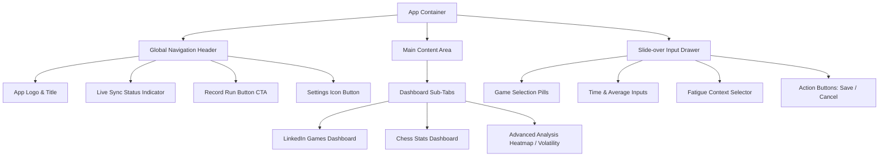

# Design Specification: App Layout & Navigation Restructuring (Modern Drawer UI)

* **Date:** 2026-06-30
* **Author:** Antigravity (UX/UI Expert)
* **Status:** Draft / Approved by User
* **Target Layout:** Option C (Modern Drawer UI)

---

## 1. Background & Goals

The current layout of the LinkedIn Games Tracker & Analyzer combines data input (New Run Form), high-level metrics, and charts on a single vertical scroll. The Google Sheets sync configuration is also exposed inline via a collapsible panel. While functional, this structure creates visual noise, especially as the application adds support for Chess and advanced analytics.

### Goals:
* **Separation of Concerns:** Keep the primary dashboard uncluttered and dedicated to data visualization and analysis.
* **Streamlined Data Entry:** Introduce a focused slide-over drawer for run inputs to avoid distraction.
* **Consolidated Settings:** Move connection settings and data management utilities to a dedicated space.
* **Unified Dashboard:** Allow quick switching between LinkedIn Games, Chess Stats, and Advanced Deep-Dives using clear tab navigation.
* **Premium Aesthetics:** Implement smooth micro-animations (Framer Motion / Motion library) and a cohesive dark UI using Tailwind CSS v4.

---

## 2. Interface Architecture



### 2.1 Global Navigation Header
* **Location:** Stays pinned (`sticky top-0`) at the top of the viewport.
* **Components:**
  * **Logo:** Left side. Emerald badge with standard branding icon.
  * **Cloud Sync Badge:** Next to the logo, reflecting Sheets status. Clicking it triggers the settings modal/drawer.
  * **Actions Area (Right Side):**
    * **`⚡ Record Run` (Primary CTA):** Styled in solid emerald. Triggers the slide-over data drawer.
    * **Settings Cog (Secondary CTA):** Replaces the collapsible settings bar, opening the sync settings overlay.

### 2.2 Slide-over Input Drawer (Right)
* **Behavior:** Appears from the right edge with a dark semi-transparent backdrop overlay. Dismissed by clicking the backdrop, hitting `Escape`, or clicking the close button (`&times;`).
* **Interactive Elements:**
  * **Game Selector:** Interactive pill-buttons instead of standard dropdowns. Clicking a pill selects the game.
  * **Form Fields:**
    * Your time (seconds or `mm:ss` format helper).
    * Community average time (pre-filled with the last known average for the selected game).
    * Context selector: `Máximo` | `Exploración` | `Anomalía` | `Cansancio` (represented by styled chips or a clean dropdown).
    * Notes: Standard text area.
  * **Footer Actions:** Pinned to the bottom. "Save Score" (primary green) and "Cancel" (secondary text button).

### 2.3 Main Dashboard & Tab Navigation
* **Global Sub-Tabs:** Located immediately at the top of the main container:
  1. **LinkedIn Games:** Focuses on Patches, Queens, Sudoku, and Zip tracking.
  2. **Chess Stats:** Displays Elo progression, win/loss history, and game logs.
  3. **Advanced Analysis:** Houses the Heatmap Activity and Volatility Trend metrics.
* **KPI Metrics Grid:**
  * Displays three responsive cards showing high-level aggregated data.
* **Visual Presentation:** 
  * Cards use a deep gray background (`#151515` / `bg-neutral-900`) with extremely thin borders (`border-neutral-800`).
  * Seamless transitions on hover.

### 2.4 Google Sheets & System Settings Overlay
* **Behavior:** Slide-over panel or centered modal.
* **Contents:**
  * Google account authentication (Sign in / Sign out).
  * Spreadsheet connection status and URL.
  * Explicit manual synchronization triggers ("Pull from Sheet", "Push to Sheet").
  * Administrative tools: "Reset All Local Data".

### 2.5 Chess-Specific Handling
* **Dynamic Drawer Fields:**
  * When `Chess` is selected from the game type pills in the slide-over drawer, the layout dynamically swaps regular timed inputs for:
    * ELO Rating (personal current rating value).
    * Target ELO (optional target).
    * Color Selection (White vs Black interactive toggles).
    * Outcome Selector (Win, Draw, Loss interactive buttons).
    * Inline CSV File Uploader (bulk CSV game imports).
* **Chess Dashboard View:**
  * Selecting the `Chess Stats` dashboard tab updates the central container to show:
    * **KPIs:** Current ELO, Peak ELO, Win Rate, and White/Black win ratios.
    * **Progress Chart:** ELO progression line chart with colored dots reflecting outcomes (emerald for wins, rose for losses, gray for draws).
    * **Log Table:** Recent Chess matches displaying color, outcome, ELO delta, and opponent/match notes.

---


## 3. Technical Implementation Details

### 3.1 Components Breakdown
All presentation components will reside in [src/presentation/components](file:///home/valentin/code/linkedin-games-analyzer/src/presentation/components):
1. `Header.tsx`: Global brand navigation, cloud status, settings toggle, and "Record Run" button.
2. `InputDrawer.tsx`: Slide-over drawer component implementing input fields, validation, and drawer open/close animations.
3. `SettingsDrawer.tsx`: Puts all Sheets sync panel functionality inside a separate drawer overlay.
4. `DashboardOverview.tsx`: Unifies top KPIs and switches rendering between `LinkedInView`, `ChessView`, and `AnalysisTabContainer`.

### 3.2 State Management & Hooks
We will keep state operations centralized in [src/presentation/hooks/useTracker.ts](file:///home/valentin/code/linkedin-games-analyzer/src/presentation/hooks/useTracker.ts) to preserve business logic integrity:
* Add `isDrawerOpen` (boolean) state.
* Add `isSettingsOpen` (boolean) state.
* Auto-populate the "Community Average" field in `InputDrawer` based on `lastCommunityAverages` returned from the hook.

### 3.3 Micro-Animations
We will utilize the `motion` library (already present in `package.json`) to create smooth transitions:
* **Drawer Slide:**
  ```typescript
  // Example Framer Motion structure
  initial={{ x: "100%" }}
  animate={{ x: 0 }}
  exit={{ x: "100%" }}
  transition={{ type: "spring", damping: 30, stiffness: 300 }}
  ```
* **Backdrop Fade:** Simple opacity interpolation from `0` to `0.5`.

---

## 4. Responsive Design System

* **Desktop (>1024px):** Slide-over drawer occupies a fixed `420px` width on the right side. Main dashboard resizes fluidly.
* **Tablet (768px - 1024px):** Slide-over drawer occupies `380px`. Main metric cards resize to a 2-column or 1-column layout.
* **Mobile (<768px):** 
  * Header layout becomes compact.
  * Slide-over drawer expands to `100vw` (full screen) with a close button on top.
  * A fixed bottom action bar or floating action button (FAB) is presented as a backup route for recording scores on small screens.

---

## 5. Security & Persistence

* No sensitive data is stored client-side except for OAuth tokens and local cache via Firebase and LocalStorage.
* Google Sheets sync settings will be securely saved, and network request loading indicators will prevent double-submissions.
